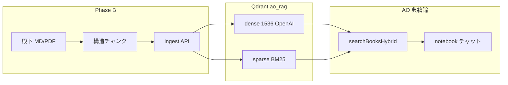

# Phase 6 — B → C ロードマップ（典籍 RAG）

方針: **B（チャンク）→ C（Qdrant ハイブリッド）**。A（部分一致フォールバック）は **実装しない**。

---

## 全体像



| 段階 | 成果物 | 本番 collection |
|------|--------|-----------------|
| **検証 POC** | `ao_rag_hybrid` + スクリプト | 触らない |
| **B** | チャンカー改善 + 再 ingest | まだ `ao_rag` dense のみ可 |
| **C** | ハイブリッド upsert / 検索 | `ao_rag` を hybrid に作り直し |

---

## ステップ 0 — 30 分検証（明日最初）

**目的:** 「イギリス人の元修道士」で **§11 が RRF 上位**になることを確認してから B/C に入る。

### 前提

- Qdrant Cloud で **Inference が有効**（クラスタ詳細 → Inference タブ）
- `web/.env` に `QDRANT_URL` / `QDRANT_API_KEY` / `OPENAI_API_KEY`
- 既存 `ao_rag` に ingest 済み（12 前後 point）

### 手順

```bash
cd web

# 1) テスト用 hybrid collection 作成（ao_rag は残す）
npm run qdrant:hybrid-poc -- init

# 2) 既存 ao_rag の books を ao_rag_hybrid へコピー（dense + BM25）
npm run qdrant:hybrid-poc -- migrate

# 3) クエリ比較（dense のみ vs hybrid RRF）
npm run qdrant:hybrid-poc -- query "イギリス人の元修道士"
```

### 成功基準

| 検索 | 期待 |
|------|------|
| **dense のみ**（現状同等） | §11 は sim≈0.16 前後・閾値 0.35 では 0 件でも可 |
| **hybrid RRF** | **上位 1〜3 に「イギリス人の元修道士まで出入り」**（§11 / chunk_index 10） |

失敗時:

- Inference 無効 → コンソールで有効化
- migrate 0 件 → `ao_rag` に point があるか確認
- RRF でも §11 が下位 → BM25 トークン化（日本語）を調査（C で対処）

---

## Phase B — チャンク改善（具体タスク）

**目的:** dense の sim を上げる・引用しやすくする（閾値 0.35 は維持）。

| # | 作業 | ファイル |
|---|------|----------|
| B1 | 構造境界チャンク（`\n\n` → `#` → 。） | `ao-chunk-profiles.ts` + `chunk-structured.ts`（新規） |
| B2 | チャンク先頭に `[典籍: 書名 §n]` を必ず含める | ingest / `qdrant-books` |
| B3 | 重複 upsert 防止（同一 source 削除を確実に） | `qdrant-books.ts` |
| B4 | ingest API が新チャンカーを使う | `api/notebook/ingest` |
| B5 | **1 冊だけ**殿下 MD で再 ingest → probe:books | 手動 |
| B6 | 問題なければ全冊再 ingest（バッチ script） | `scripts/ingest-books-batch.ts`（必要なら） |

**金額:** 再 embed したチャンク数 × 約 $0.00002/チャンク（5,000 本 ≈ $0.05〜0.30）。  
**時間:** 幕僚 **1〜2 日** + 殿下の再 ingest 待ち。

**本番 DB:** `extracted_text` は空のまま（`025`）。

---

## Phase C — Qdrant ハイブリッド（具体タスク）

**前提:** ステップ 0 POC 成功。

| # | 作業 | 内容 |
|---|------|------|
| C1 | collection 定義 | `dense` 1536 Cosine + `bm25` sparse IDF |
| C2 | `ensureQdrantHybridCollection()` | `qdrant-client.ts` 拡張 |
| C3 | upsert | point ごと `dense`（OpenAI）+ `bm25`（`{ text, model: "qdrant/bm25" }`） |
| C4 | search | `POST .../points/query` prefetch dense + bm25 → `rrf` |
| C5 | `searchBooksQdrant` 差し替え | `rag-phase5.ts` は呼び口のみ |
| C6 | 本番移行 | `ao_rag` 削除 → hybrid 作り直し → **全典籍 re-ingest**（B チャンク後が望ましい） |
| C7 | ドキュメント | 令旨・Setup 更新 |

**叩くのは典籍論のみ**（`searchBooksQdrant`）。他論・Supabase thread/wiki は不変。

**金額:** Qdrant クラスタ **Free のまま**（クエリ従量なし）。OpenAI は ingest 再処理分のみ。  
**時間:** 幕僚 **3〜5 日**（B 完了後）。

**A を入れない理由:** C の BM25 が「キーワード拾い」を担う。A はデッドコードになる。

---

## 実行順（殿下）

1. **今日/明日:** ステップ 0（`npm run qdrant:hybrid-poc`）
2. **POC OK → B**（チャンク + 1 冊試し）
3. **B OK → C**（本番 hybrid + 全再 ingest）
4. 典籍論チャットで §5 に `## 典籍（ソース）` と §11 文面を確認

---

## 環境変数（C 以降）

```env
QDRANT_COLLECTION=ao_rag          # C 本番移行後も同名で hybrid 中身
QDRANT_HYBRID_COLLECTION=ao_rag_hybrid  # POC のみ
```
